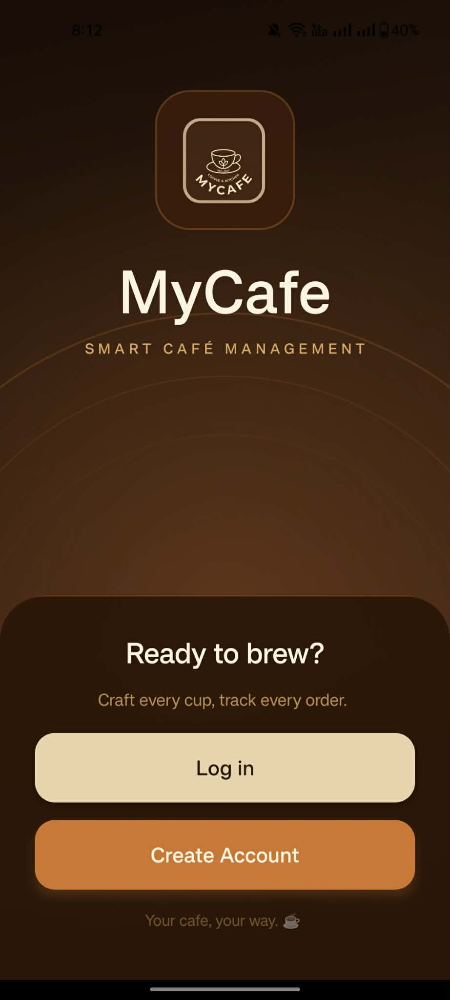
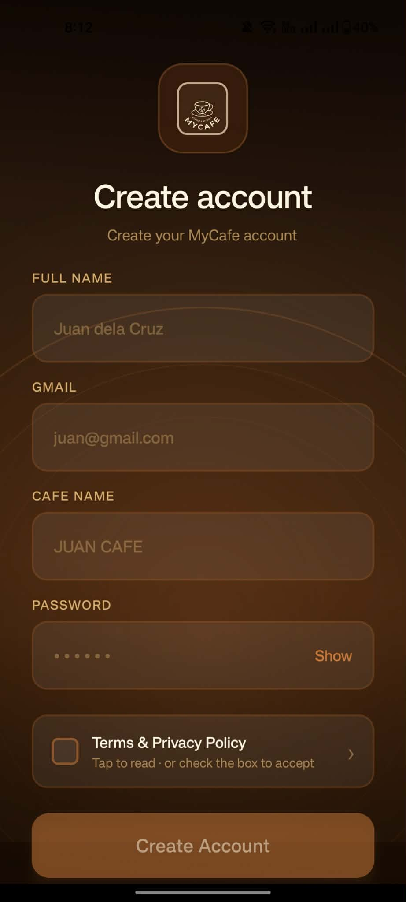
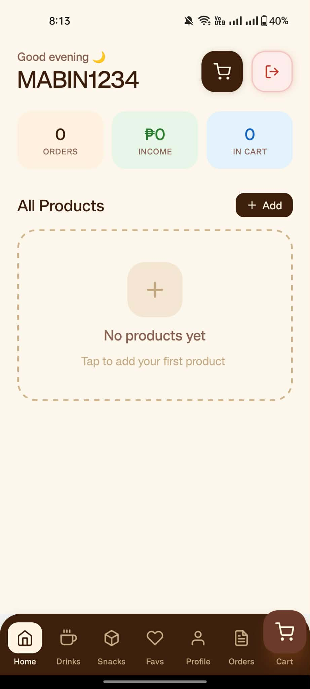
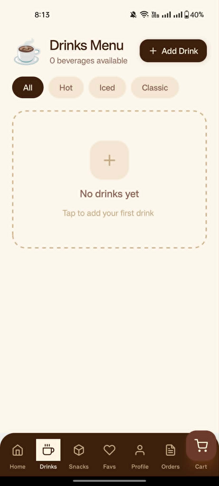
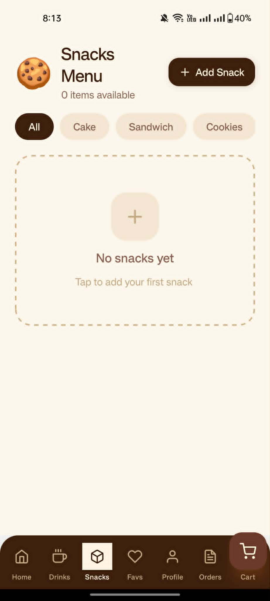
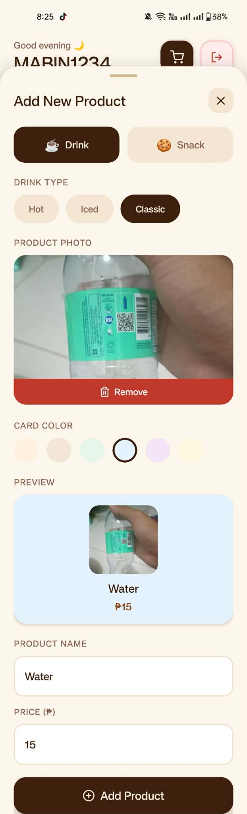
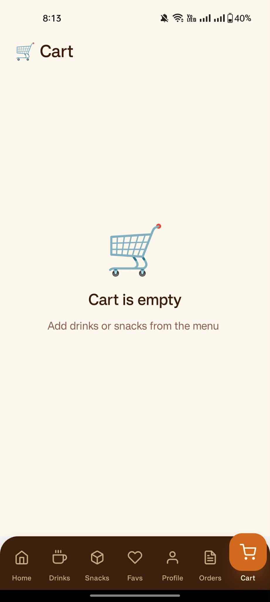
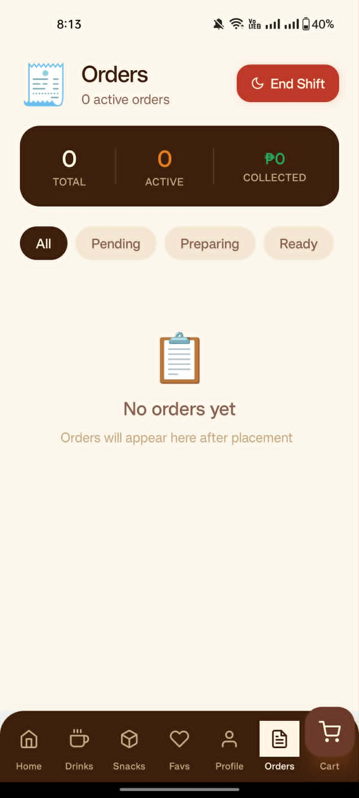

# MyCafe 👋

## App Name

MyCafe

## ✨ Short Description

MyCafe is a simple and easy-to-use mobile app designed to help café owners manage customer orders and streamline daily operations. It makes order tracking faster, more organized, and hassle-free.

## ⚠️ Problem Statement

Many café businesses still rely on manual processes such as writing down customer orders, calculating totals by hand, and tracking daily sales on paper. These traditional methods are time-consuming and prone to errors, such as incorrect orders, miscalculations, and lost records. As a result, operations become inefficient during busy hours, leading to delays, customer dissatisfaction, and difficulty in monitoring business performance.

## 🎯 Target Users

The primary users of MyCafe are café owners and small café business operators who want a more organized way to manage their daily transactions and operations.

---

This is an [Expo](https://expo.dev) project created with [`create-expo-app`](https://www.npmjs.com/package/create-expo-app).

## Get started

1. Install dependencies

   ```bash
   npm install
   ```

2. Start the app

   ```bash
   npx expo start
   ```

In the output, you'll find options to open the app in a

- [development build](https://docs.expo.dev/develop/development-builds/introduction/)
- [Android emulator](https://docs.expo.dev/workflow/android-studio-emulator/)
- [iOS simulator](https://docs.expo.dev/workflow/ios-simulator/)
- [Expo Go](https://expo.dev/go), a limited sandbox for trying out app development with Expo

You can start developing by editing the files inside the **app** directory. This project uses [file-based routing](https://docs.expo.dev/router/introduction).

## Privacy & Security

- User authentication is required to access Firestore and Storage data.
- Firestore data is scoped to the authenticated user's `users/{uid}` document and subcollections.
- Storage uploads are restricted to `profilePics/{uid}` and `productImages/{uid}` paths for the signed-in user.
- Profile uploads and offline data are cached locally using AsyncStorage, and synced only when network connectivity returns.
- Sensitive app data is not shared across users; each authenticated user manages only their own products, orders, and profile data.

## Get a fresh project

When you're ready, run:

```bash
npm run reset-project
```

This command will move the starter code to the **app-example** directory and create a blank **app** directory where you can start developing.

## Learn more

To learn more about developing your project with Expo, look at the following resources:

- [Expo documentation](https://docs.expo.dev/): Learn fundamentals, or go into advanced topics with our [guides](https://docs.expo.dev/guides).
- [Learn Expo tutorial](https://docs.expo.dev/tutorial/introduction/): Follow a step-by-step tutorial where you'll create a project that runs on Android, iOS, and the web.

## Join the community

Join our community of developers creating universal apps.

- [Expo on GitHub](https://github.com/expo/expo): View our open source platform and contribute.
- [Discord community](https://chat.expo.dev): Chat with Expo users and ask questions.

# ☕ MyCafe — Mobile Café Management Application

> A React Native + Expo mobile application for managing café orders, products, and daily sales operations.  
> Built for **ADET 2 (Application Development & Emerging Technologies 2)**  
> Sorsogon State University — College of ICT, Bulan Campus

---

## 📋 Table of Contents

- [Midterm vs Final Feature List](#midterm-vs-final-feature-list)
- [Architecture Overview](#architecture-overview)
- [Firebase Configuration](#firebase-configuration)
- [Security Rules Summary](#security-rules-summary)
- [Screenshots](#screenshots)
- [Build Instructions](#build-instructions)

---

## Midterm vs Final Feature List

| Feature | Midterm (MVP) | Final (Full Build) |
|---|---|---|
| User Registration & Login | ✅ | ✅ |
| Home Dashboard | ✅ | ✅ Enhanced |
| Drinks Menu Screen | ✅ | ✅ |
| Snacks Menu Screen | ✅ | ✅ |
| Product Detail View | ✅ | ✅ |
| Add to Cart | ✅ | ✅ |
| Place Order | ✅ | ✅ |
| Favorites Screen | ✅ | ✅ |
| Orders List Screen | ✅ | ✅ |
| Bottom Tab Navigation | ✅ | ✅ |
| Guest / Public Browsing Mode | ✅ | ✅ |
| Empty & Error State UI | ✅ | ✅ |
| Add / Edit / Delete Products | ✅ Basic | ✅ Full |
| Product Image Upload (Camera & Gallery) | ❌ | ✅ |
| Firebase Storage Integration | ❌ | ✅ |
| Real-time Firestore Listeners | ❌ | ✅ |
| Offline-First Sync (AsyncStorage) | ❌ | ✅ |
| Expo Camera Integration | ❌ | ✅ |
| Expo Location + React Native Maps | ❌ | ✅ |
| Personalized Product Recommendations | ❌ | ✅ |
| Context-Aware Greetings (time/location) | ❌ | ✅ |
| Sales Summary / Analytics | ❌ | ✅ |
| Profile Management | ❌ | ✅ |
| Firestore Security Rules | Basic | ✅ Full enforcement |

---

## Architecture Overview

### Folder Structure

```
MyCafe/
├── assets/                  # Images, icons, fonts
├── src/
│   ├── components/          # Reusable UI components
│   │   ├── ProductCard.js
│   │   ├── OrderItem.js
│   │   └── EmptyState.js
│   ├── screens/             # One file per screen
│   │   ├── LoginScreen.js
│   │   ├── SignUpScreen.js
│   │   ├── HomeScreen.js
│   │   ├── DrinksScreen.js
│   │   ├── SnacksScreen.js
│   │   ├── ProductDetailScreen.js
│   │   ├── CartScreen.js
│   │   ├── OrdersScreen.js
│   │   ├── FavoritesScreen.js
│   │   └── ProfileScreen.js
│   ├── navigation/          # Navigation configuration
│   │   ├── AppNavigator.js  # Root stack navigator
│   │   └── BottomTabs.js    # Bottom tab navigator
│   ├── firebase/            # Firebase setup
│   │   ├── firebaseConfig.js
│   │   ├── authService.js
│   │   ├── firestoreService.js
│   │   └── storageService.js
│   ├── hooks/               # Custom React hooks
│   │   ├── useAuth.js
│   │   └── useProducts.js
│   ├── context/             # Global state via Context API
│   │   └── AuthContext.js
│   └── utils/               # Helpers and constants
│       ├── recommendations.js
│       └── offlineSync.js
├── app.json                 # Expo app configuration
├── eas.json                 # EAS Build configuration
├── .env                     # Environment variables (not committed)
├── .gitignore
└── App.js                   # Entry point
```

### State Management Approach

MyCafe uses the **React Context API** for global state — no third-party state library (no Redux). State is kept as close to the component that needs it as possible, and lifted only when shared across multiple screens.

| State Type | Where It Lives |
|---|---|
| Authenticated user session | `AuthContext` (global) |
| Product list | `useProducts` custom hook + Firestore listener |
| Cart items | Local component state in `CartScreen` |
| Favorites | Firestore subcollection, fetched per session |
| Offline cache | `AsyncStorage` via `offlineSync.js` |

### Navigation Approach

Navigation is handled by **React Navigation v6**, using a combination of a Stack Navigator and a Bottom Tab Navigator.

```
Stack Navigator (AppNavigator)
├── LoginScreen          ← unauthenticated entry
├── SignUpScreen
└── BottomTabs           ← authenticated entry
    ├── HomeScreen
    ├── MenuScreen (Drinks / Snacks tabs)
    ├── CartScreen
    ├── OrdersScreen
    └── ProfileScreen
```

Guest users are routed into a limited version of the Bottom Tabs where Cart and Orders are replaced with a sign-in prompt.

---

## Firebase Configuration

Firebase credentials are **never hardcoded** in the source files. All sensitive keys are stored in a `.env` file at the project root and accessed via `expo-constants` or `react-native-dotenv`.

### `.env` file (not committed to Git)

```
FIREBASE_API_KEY=your_api_key_here
FIREBASE_AUTH_DOMAIN=your_project.firebaseapp.com
FIREBASE_PROJECT_ID=your_project_id
FIREBASE_STORAGE_BUCKET=your_project.appspot.com
FIREBASE_MESSAGING_SENDER_ID=your_sender_id
FIREBASE_APP_ID=your_app_id
```

### `firebaseConfig.js`

```javascript
import Constants from 'expo-constants';

const firebaseConfig = {
  apiKey:            Constants.expoConfig.extra.FIREBASE_API_KEY,
  authDomain:        Constants.expoConfig.extra.FIREBASE_AUTH_DOMAIN,
  projectId:         Constants.expoConfig.extra.FIREBASE_PROJECT_ID,
  storageBucket:     Constants.expoConfig.extra.FIREBASE_STORAGE_BUCKET,
  messagingSenderId: Constants.expoConfig.extra.FIREBASE_MESSAGING_SENDER_ID,
  appId:             Constants.expoConfig.extra.FIREBASE_APP_ID,
};

export default firebaseConfig;
```

### `.gitignore` entries

```
.env
google-services.json
GoogleService-Info.plist
```

> ⚠️ Never commit `.env`, `google-services.json`, or `GoogleService-Info.plist` to a public repository.

---

## Security Rules Summary

Firestore Security Rules enforce two core principles: **authentication enforcement** and **ownership validation**. Only the authenticated café owner can read or write their own data.

```js
rules_version = '2';
service cloud.firestore {
  match /databases/{database}/documents {

    // Helper functions
    function isSignedIn() {
      return request.auth != null;
    }

    function isOwner(userId) {
      return request.auth.uid == userId;
    }

    // Users collection
    match /users/{userId} {
      allow read, write: if isSignedIn() && isOwner(userId);

      // Products subcollection
      match /products/{productId} {
        allow read:   if isSignedIn() && isOwner(userId);
        allow create: if isSignedIn() && isOwner(userId);
        allow update: if isSignedIn() && isOwner(userId);
        allow delete: if isSignedIn() && isOwner(userId);
      }

      // Orders subcollection
      match /orders/{orderId} {
        allow read:   if isSignedIn() && isOwner(userId);
        allow create: if isSignedIn() && isOwner(userId);
        allow update: if isSignedIn() && isOwner(userId);
        allow delete: if isSignedIn() && isOwner(userId);
      }
    }
  }
}
```

**Firebase Storage Rules:**

```js
rules_version = '2';
service firebase.storage {
  match /b/{bucket}/o {
    match /users/{userId}/{allPaths=**} {
      allow read, write: if request.auth != null && request.auth.uid == userId;
    }
  }
}
```

| Rule | Enforcement |
|---|---|
| Unauthenticated access | Denied on all collections |
| Reading another user's products | Denied — UID must match |
| Writing to another user's orders | Denied — UID must match |
| Uploading images without auth | Denied by Storage rules |
| Accessing root-level collections | No rules defined — denied by default |

---

## Screenshots

Place all screenshots inside a `/screenshots` folder at the root of the project.

| # | Screen | File |
|---|---|---|
| 01 | Login Screen | `screenshots/01_login.jpg` |
| 02 | Sign Up Screen | `screenshots/02_signup.jpg` |
| 03 | Home Dashboard | `screenshots/03_home.jpg` |
| 04 | Drinks Menu | `screenshots/04_drinks.jpg` |
| 05 | Snacks Menu | `screenshots/05_snacks.jpg` |
| 06 | Product Detail | `screenshots/06_product_detail.jpg` |
| 07 | Cart Screen | `screenshots/07_cart.jpg` |
| 08 | Orders List | `screenshots/08_orders.jpg` |
| 09 | Empty State (no orders) | `screenshots/9_empty_state.jpg` |
| 10 | Favorites Screen | `screenshots/10_favorites.jpg` |
| 11 | Profile Screen | `screenshots/11_profile.jpg` |

**01 — Login Screen**


**02 — Sign Up Screen**


**03 — Home Dashboard**


**04 — Drinks Menu**


**05 — Snacks Menu**


**06 — Product Detail**


**07 — Cart Screen**


**08 — Orders List**


**9 — Empty State**


---

## Build Instructions

### Prerequisites

Make sure the following are installed on your machine before running the project:

| Tool | Version | Install |
|---|---|---|
| Node.js | v18 or higher | [nodejs.org](https://nodejs.org) |
| npm or yarn | Latest | Comes with Node |
| Expo CLI | Latest | `npm install -g expo-cli` |
| EAS CLI | Latest | `npm install -g eas-cli` |
| Android Studio | Latest | For Android emulator |
| Expo Go app | Latest | Install on your physical device |

---

### 1. Clone the Repository

```bash
git clone https://github.com/your-username/mycafe.git
cd mycafe
```

### 2. Install Dependencies

```bash
npm install
```

### 3. Set Up Environment Variables

Create a `.env` file at the project root and fill in your Firebase project credentials:

```bash
cp .env.example .env
```

Then edit `.env` with your actual Firebase config values.

### 4. Run in Development (Expo Go)

```bash
npx expo start
```

- Press `a` to open on Android emulator
- Press `i` to open on iOS simulator
- Scan the QR code with the **Expo Go** app on your physical device

### 5. Build for Android (EAS Build)

Log in to your Expo account first:

```bash
eas login
```

Configure the build:

```bash
eas build:configure
```

Create a preview APK (for testing without the Play Store):

```bash
eas build --platform android --profile preview
```

Create a production build:

```bash
eas build --platform android --profile production
```

The EAS dashboard will provide a download link for the `.apk` or `.aab` file once the build completes.

### 6. Run on Physical Device (without EAS)

Install Expo Go from the Google Play Store or Apple App Store, then run:

```bash
npx expo start --tunnel
```

Scan the QR code shown in the terminal with Expo Go.

---

### Common Issues

| Issue | Fix |
|---|---|
| `FirebaseError: permission-denied` | Check Firestore Security Rules and confirm the user is authenticated |
| Camera not working on emulator | Use a physical device — emulators have limited camera support |
| `.env` values not loading | Confirm `app.json` exposes them via the `extra` field and restart the Metro bundler |
| Offline sync not triggering | Ensure AsyncStorage is installed: `npx expo install @react-native-async-storage/async-storage` |
| Build fails on EAS | Run `eas build --clear-cache --platform android` to clear stale build artifacts |

---

## Authors

**Estrabela, Edison D.** — Sorsogon State University, BSCS
**Larosa, Marvin E.** — Sorsogon State University, BSCS

**Course:** Application Development & Emerging Technologies 2 (ADET 2)  
**Instructor:** Ceilo F. Gabotero  
**Campus:** Bulan Campus, Sorsogon State University  
**Year:** 2026
